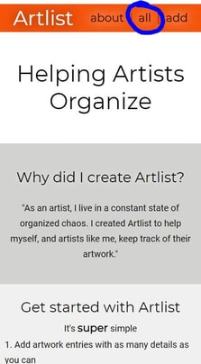
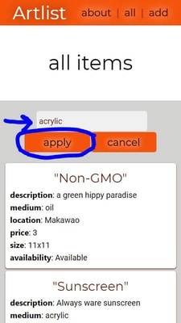
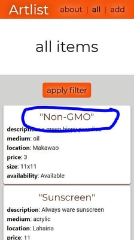

# Artlist

A way for artists to organize their work.
This app allows you to create custom lists of art for yourself and clients. Organize and sort your list with filters that include everything from medium to location of the piece.

## Live Link

[Click Here](https://artlist-app.now.sh/) to view it in the browser.

## How to use it

### Add an item to your list

1. From any page, click "add" 
2. Enter a title and as many details as you can then click "save" 

### Find items in your list

1. #### From any page, click "all"

   \

2. #### Click "add filter"

   \

3. #### Choose the filter type

   \

4. #### Enter filter details and click "apply"

   \

5. #### Continue to add filters until satisfied

### Edit items in your list

1. #### From any page, click "all"

   \

2. #### Click the title of the item you want to edit

   \

3. #### Scroll to the bottom and click "edit"

   \

4. #### Input new details and click "save"

   \

## Endpoints

- "/" landing page that describes the app, how to use, and gives a link to a survey.
- "/view" view all items in the art list and filter what items you see.
- "/add" add new items to the artlist
- "/view/:id" see the details of an item and choose to edit or delete it
- "/edit/:id" edit the details of an item

## API endpoints

- "GET /" returns a cute greeting
- "GET /list" returns a list of all items in the "list" table
- "POST /list" adds a new item to the "list" table ("title" string is required)
- "GET /list/:item-id" returns an item with the id that matches item-id
- "PATCH /list/:item-id" edits an item with the id that matches item-id (requires one of the following values: title, description, medium, location, price, size, availability)
- "DELETE /list/:item-id" deletes an item with the id that matches item-id

### Technologies used

This client side app is written in: HTML5, CSS3, Javascript ES6, and JSX.
I used React as a framework and Jest for testing.
The RESTful API was written in Javascript using Node.js with Express.
The database uses PostgreSQL.
